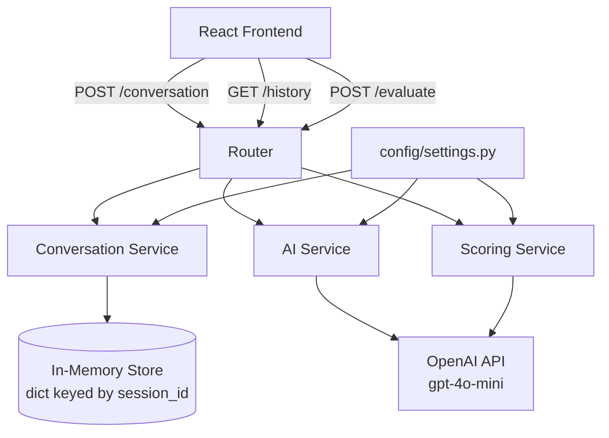

# Design Document: Fluenta AI Backend

## Overview

The Fluenta AI backend is a Python/FastAPI service that powers real-time English conversation coaching. It receives user text from a React frontend, maintains per-session conversation memory, calls OpenAI's `gpt-4o-mini` to generate coaching responses, and returns structured replies with realistic scores.

The current codebase has a single route with a global (shared) conversation history and hardcoded scores. This design replaces that with a modular, multi-user capable architecture.

---

## Architecture



All services are stateless functions/classes. The only shared state is the in-memory session store inside `Conversation_Service`, which is safe for concurrent use because Python's `dict` operations are thread-safe for simple reads/writes, and FastAPI runs on a single process by default with async handlers.

---

## Components and Interfaces

### `config/settings.py`

Reads environment variables and exposes typed constants.

```python
OPENAI_API_KEY: str        # from env, required
OPENAI_MODEL: str          # default "gpt-4o-mini"
MAX_HISTORY_LENGTH: int    # default 10
```

Raises `ValueError` at import time if `OPENAI_API_KEY` is missing.

---

### `services/conversation_service.py`

Manages per-session message history using an in-memory dict.

```python
def get_history(session_id: str) -> list[dict]
def save_message(session_id: str, role: str, content: str) -> None
def clear_history(session_id: str) -> None
def get_context_window(session_id: str, n: int) -> list[dict]
```

- `get_history` returns all messages for a session (empty list if none).
- `save_message` appends `{"role": role, "content": content}` to the session.
- `clear_history` deletes the session key entirely.
- `get_context_window` returns the last `n` messages for use as OpenAI context.

Internal store: `_sessions: dict[str, list[dict]] = {}`

---

### `services/ai_service.py`

Calls OpenAI and returns a structured coaching response.

```python
async def get_ai_response(user_text: str, history: list[dict]) -> dict
```

- Builds a message list: `[system_prompt] + history[-MAX_HISTORY_LENGTH:] + [user_message]`
- Calls `client.chat.completions.create(model=OPENAI_MODEL, messages=..., response_format={"type": "json_object"})`
- Parses and returns the JSON response.
- Raises `AIServiceError` on API failure.

System prompt instructs the model to:
1. Reply naturally as Fluenta, a friendly English coach.
2. Correct grammar with a short explanation (field: `correction`).
3. Suggest a vocabulary improvement if relevant (field: `tip`).
4. Ask one follow-up question at the end of the reply.
5. Return ONLY valid JSON: `{ "reply": str, "correction": str, "tip": str, "score": { "fluency": int, "grammar": int, "pronunciation": int, "vocabulary": int, "explanations": { ... } } }`

---

### `services/scoring_service.py`

Generates realistic scores from user text, optionally using AI.

```python
async def score_text(user_text: str, context: str = "") -> Score
```

- For text-only input: sends the text to OpenAI with a scoring-focused prompt and parses the returned score JSON.
- Returns a `Score` Pydantic model.
- If `user_text` is empty/whitespace: returns `Score` with all values 0 and explanations indicating no input.

The scoring prompt asks the model to evaluate:
- **Fluency**: sentence flow, naturalness, word order
- **Grammar**: correctness of tense, agreement, articles
- **Pronunciation** (text proxy): word choice complexity, common mispronunciation risk
- **Vocabulary**: range and appropriateness of words used

---

### `services/transcript_service.py`

Stub for future audio-to-text conversion.

```python
def transcribe(audio_bytes: bytes) -> str
```

- Currently returns `""` (no-op stub).
- Designed to be replaced with Whisper API or similar without changing the interface.

---

### `schemas/conversation_schema.py`

Pydantic models for API request/response validation.

```python
class ConversationRequest(BaseModel):
    session_id: str
    text: str

class ScoreExplanations(BaseModel):
    fluency: str
    grammar: str
    pronunciation: str
    vocabulary: str

class Score(BaseModel):
    fluency: int
    grammar: int
    pronunciation: int
    vocabulary: int
    explanations: ScoreExplanations

class ConversationResponse(BaseModel):
    reply: str
    correction: str
    tip: str
    score: Score

class EvaluateRequest(BaseModel):
    text: str

class HistoryMessage(BaseModel):
    role: str
    content: str

class HistoryResponse(BaseModel):
    session_id: str
    messages: list[HistoryMessage]
```

---

### `models/conversation.py`

Internal domain models (mirrors schemas but used within services).

```python
class Message(BaseModel):
    role: str
    content: str
```

---

### `routes/ai_routes.py`

FastAPI router. Orchestrates service calls, no business logic.

```
POST /conversation   → ConversationRequest → ConversationResponse
GET  /history        → ?session_id=str     → HistoryResponse
POST /evaluate       → EvaluateRequest     → Score
```

Route logic for `POST /conversation`:
1. `conversation_service.save_message(session_id, "user", text)`
2. `history = conversation_service.get_context_window(session_id, MAX_HISTORY_LENGTH)`
3. `ai_result = await ai_service.get_ai_response(text, history)`
4. `conversation_service.save_message(session_id, "assistant", ai_result["reply"])`
5. Return `ConversationResponse`

---

## Data Models

### Session Store (in-memory)

```
{
  "session_abc123": [
    {"role": "user", "content": "I go to school yesterday."},
    {"role": "assistant", "content": "Great effort! You should say 'I went to school yesterday'..."}
  ],
  "session_xyz789": [...]
}
```

### OpenAI Message Format

```
[
  {"role": "system", "content": "<system_prompt>"},
  {"role": "user",   "content": "..."},
  {"role": "assistant", "content": "..."},
  ...
  {"role": "user",   "content": "<current message>"}
]
```

### Score Object

```json
{
  "fluency": 78,
  "grammar": 65,
  "pronunciation": 72,
  "vocabulary": 80,
  "explanations": {
    "fluency": "Sentences flow naturally but some hesitation markers present.",
    "grammar": "Incorrect past tense used ('go' instead of 'went').",
    "pronunciation": "Word choices suggest moderate pronunciation complexity.",
    "vocabulary": "Good range of everyday vocabulary used appropriately."
  }
}
```

---

## Correctness Properties

A property is a characteristic or behavior that should hold true across all valid executions of a system — essentially, a formal statement about what the system should do. Properties serve as the bridge between human-readable specifications and machine-verifiable correctness guarantees.


### Property 1: Session history round-trip

*For any* `session_id` and any ordered sequence of messages saved via `save_message`, calling `get_history` should return exactly those messages in the same order, with the correct roles.

**Validates: Requirements 1.1, 1.2, 1.3**

Edge case: for a `session_id` that has never had messages saved, `get_history` returns `[]`.

---

### Property 2: Clear history is a reset

*For any* `session_id` with any number of saved messages, calling `clear_history` followed by `get_history` should return an empty list.

**Validates: Requirements 1.4**

---

### Property 3: Session isolation

*For any* two distinct `session_id` values A and B, saving messages to session A should leave session B's history unchanged.

**Validates: Requirements 1.5**

---

### Property 4: Context window truncation

*For any* conversation history of length N > MAX_HISTORY_LENGTH, the message list constructed for the OpenAI API call should contain exactly MAX_HISTORY_LENGTH messages from the end of the history (plus the system prompt).

**Validates: Requirements 2.2**

---

### Property 5: Score shape invariant

*For any* non-empty text input, the Score returned by `Scoring_Service` should have all four numeric fields (fluency, grammar, pronunciation, vocabulary) in the range [0, 100], and all four explanation strings should be non-empty.

**Validates: Requirements 3.1, 3.3**

Edge case: for any string composed entirely of whitespace characters, all four score values should equal 0.

---

### Property 6: Score variation (metamorphic)

*For any* pair of inputs where one is a grammatically correct English sentence and the other contains an obvious grammar error, the grammar score for the correct sentence should be greater than or equal to the grammar score for the erroneous sentence.

**Validates: Requirements 3.2, 3.6**

---

## Error Handling

| Scenario | Behavior |
|---|---|
| `OPENAI_API_KEY` not set | `ValueError` raised at startup in `settings.py` |
| OpenAI API call fails (network, rate limit, etc.) | `AIServiceError` raised in `ai_service.py`, caught by route, returns HTTP 503 |
| Malformed request body (missing fields) | FastAPI/Pydantic returns HTTP 422 automatically |
| Empty/whitespace text to scoring service | Returns Score with all zeros, no exception |
| Unknown `session_id` in GET /history | Returns empty `messages` list with HTTP 200 |
| `transcribe()` called with empty bytes | Returns `""` without error |

---

## Testing Strategy

### Dual Testing Approach

Both unit tests and property-based tests are used. They are complementary:
- Unit tests catch concrete bugs with specific inputs and verify integration points.
- Property tests verify universal correctness across many generated inputs.

### Property-Based Testing Library

**Library**: `hypothesis` (Python)

Install: `pip install hypothesis`

Each property test runs a minimum of 100 iterations. Tests are tagged with a comment referencing the design property.

```python
# Feature: fluenta-ai-backend, Property 1: Session history round-trip
@given(st.text(min_size=1), st.lists(st.fixed_dictionaries({
    "role": st.sampled_from(["user", "assistant"]),
    "content": st.text(min_size=1)
}), min_size=1, max_size=20))
@settings(max_examples=100)
def test_session_history_round_trip(session_id, messages):
    ...
```

### Unit Tests

Focus on:
- Specific API route responses (status codes, response shape)
- Schema validation (missing fields → 422)
- Error conditions (missing API key, API failure)
- Transcript service stub behavior
- Settings module configuration

### Property Tests

| Property | Test Description |
|---|---|
| Property 1 | Save N messages, verify get_history returns them in order |
| Property 2 | Save messages, clear, verify empty list |
| Property 3 | Save to session A, verify session B unchanged |
| Property 4 | Build context window from history > MAX_HISTORY_LENGTH, verify truncation |
| Property 5 | Score any non-empty text, verify range [0,100] and non-empty explanations |
| Property 6 | Compare grammar scores for correct vs erroneous sentences |

### Test File Locations

```
backend/
  tests/
    test_conversation_service.py   # Properties 1, 2, 3
    test_ai_service.py             # Property 4, unit tests for prompt building
    test_scoring_service.py        # Properties 5, 6
    test_routes.py                 # Unit tests for all routes
    test_schemas.py                # Unit tests for schema validation
    test_settings.py               # Unit test for missing API key
```
